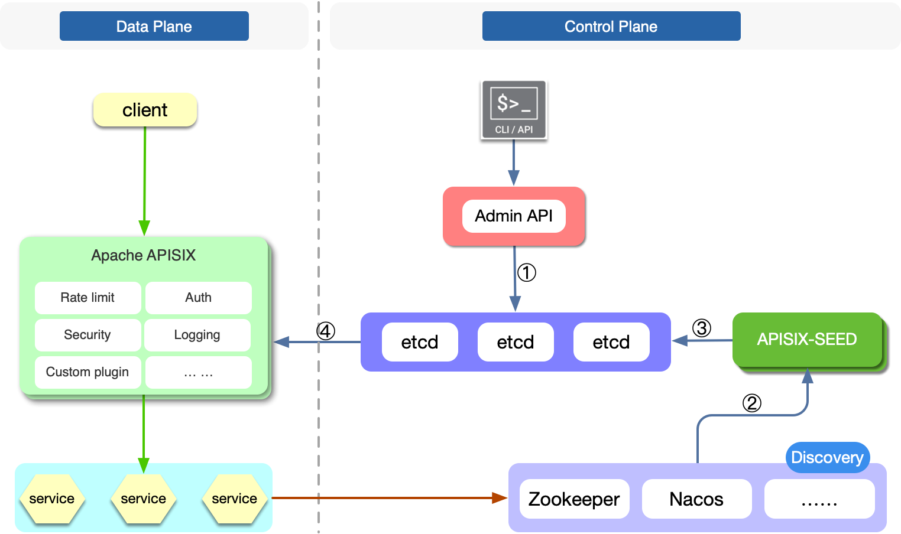

# APISIX-Seed for Apache APISIX
[](https://goreportcard.com/report/github.com/api7/apisix-seed)
[](https://github.com/api7/apisix-seed/actions)
[](https://codecov.io/gh/api7/apisix-seed)

Do service discovery for Apache APISIX on the Control Plane.

# What's APISIX-Seed
[Apache APISIX](https://github.com/apache/apisix) is a dynamic, real-time, high-performance API gateway.

In terms of architecture design, Apache APISIX is divided into two parts: data plane and control plane. The data plane is Apache APISIX itself, which is the component of the traffic proxy and offers many full-featured plugins covering areas such as authentication, security, traffic control, serverless, analytics & monitoring, transformation and logging.
The control plane is mainly used to manage routing, and implement the configuration center through etcd.

For cloud-native gateways, it is necessary to dynamically obtain the latest service instance information (service discovery) through the service registry. Currently, Apache APISIX already supports [service discovery](https://github.com/apache/apisix/blob/master/docs/en/latest/discovery.md) in the data plane.

This project is a component of Apache APISIX to implement service discovery in the control plane. It supports cluster deployment. At present, we have supported zookeeper and nacos. We will also support more service registries.

The following figure is the topology diagram of APISIX-Seed deployment.



# Why APISIX-Seed
- Network topology becomes simpler

> APISIX does not need to maintain a network connection with each registry, and only needs to pay attention to the configuration information in etcd. This will greatly simplify the network topology.

- Total data volume about upstream service becomes smaller
> Due to the characteristics of the registry, APISIX may store the full amount of registry service data in the worker, such as consul_kv. By introducing APISIX-Seed, each process of APISIX will not need to additionally cache upstream service-related information.

- Easier to manage
> Service discovery configuration needs to be configured once per APISIX instance. By introducing APISIX-Seed, Apache APISIX will be indifferent to the configuration changes of the service registry.

# How it works
APISIX-Seed completes data exchange by observing changes in etcd and service registry at the same time.

As shown in the above architecture diagram, the workflow of APISIX-Seed is as follows:

1. Register an upstream with APISIX and specify the service discovery type. APISIX-Seed will watch APISIX resource changes in etcd, filter discovery types, and obtain service names.

2. APISIX-Seed subscribes the specified service name to the service registry to obtain changes to the corresponding service.

3. After registering the service with the service registry, APISIX-Seed will obtain the new service information and write the updated service node into etcd.

4. When the corresponding resources in etcd change, APISIX worker will refresh the latest service node information to memory.

**It should be noted that after the introduction of APISIX-Seed, if the service of the registry changes frequently, the data in etcd will also change frequently.**

**The [multi-version concurrency control](https://etcd.io/docs/v3.5/learning/api/#revisions) data model in etcd keeps an exact history of the keyspace.**

**So, it is best to set the `--auto-compaction` option when starting etcd to compress the history periodically to avoid etcd eventually eventually exhaust its storage space.**

# Development

The following will take the nacos service registry as an example to show how to deploy and use APISIX-Seed to complete service discovery. Before starting, please make sure that you have installed Apache APISIX correctly. And make sure it can work properly.

## Step 1: Deploy Nacos

Quickly deploy Nacos using the Nacos Docker image:
```bash
docker run --name nacos-quick -e MODE=standalone -p 8848:8848 -d nacos/nacos-server:2.0.2
```

## Step 2: Install APISIX-Seed

Download and build APISIX-Seed:
```bash
git clone https://github.com/api7/apisix-seed.git
cd apisix-seed
make build && make install
```

The default configuration file is in `/usr/local/apisix-seed/conf/conf.yaml` with the following contents:
```yaml
etcd:                            # APISIX etcd Configure
  host:
    - "http://127.0.0.1:2379"
  prefix: /apisix
  timeout: 30

discovery:                       # service discovery center
  nacos:
    host:                        # it's possible to define multiple nacos hosts addresses of the same nacos cluster.
      - "http://127.0.0.1:8848"
    prefix: /nacos
    weight: 100                  # default weight for node
    timeout:
      connect: 2000              # default 2000ms
      send: 2000                 # default 2000ms
      read: 5000                 # default 5000ms
```
You can easily understand each configuration item, we will not explain it additionally.

Start APISIX-Seed:
```bash
APISIX_SEED_WORKDIR=/usr/local/apisix-seed /usr/local/apisix-seed/apisix-seed
```

## Step 3: Register the upstream service

Start the httpbin service via Docker:
```bash
docker run -d -p 8080:80 --rm kennethreitz/httpbin
```

Register the service to Nacos:
```bash
curl -X POST 'http://127.0.0.1:8848/nacos/v1/ns/instance?serviceName=httpbin&ip=127.0.0.1&port=8080'
```

## Step 4: Verify in Apache APISIX

Start Apache APISIX with default configuration:
```bash
apisix start
```

Create a Route through the Admin API interface of Apache APISIX:
```bash
curl http://127.0.0.1:9080/apisix/admin/routes/1 -H 'X-API-KEY: edd1c9f034335f136f87ad84b625c8f1' -X PUT -i -d '
{
    "uris": "/*",
    "hosts": [
        "httpbin"
    ],
    "upstream": {
        "discovery_type": "nacos",
        "service_name": "httpbin",
        "type": "roundrobin"
    }
}'
```

Send a request to confirm whether service discovery is in effect:
```bash
curl http://127.0.0.1:9080/get -H 'Host: httpbin'
```
